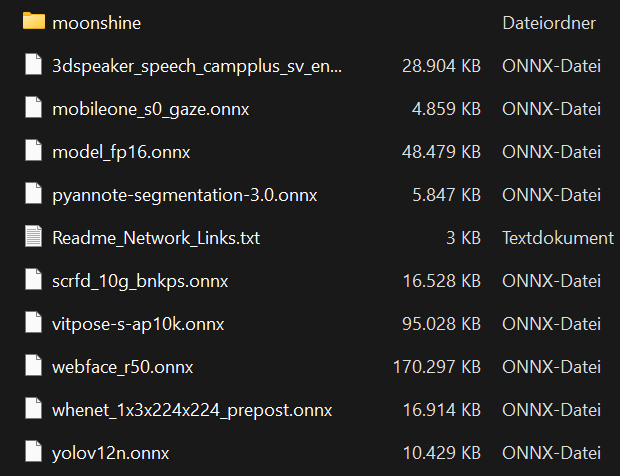

# Neural Network Models

Below is a list of publicly available `ONNX` models, which is a platform independent, single file neural network file format.   
*When not using the* **Onnx-Downloader**, manually download the network files and place them in:  
`Plugins/OpenAnimal/Content/OnnxNetworks` folder and the moonshine models to `OnnxNetworks/moonshine` folder.  
The plugin will automatically detect all networks and log any issues encountered during loading. 

## Network Links

* Yolov12 Object Detection  
[`https://github.com/mohamedsamirx/YOLOv12-ONNX-CPP/blob/main/models/yolov12n.onnx`](https://github.com/mohamedsamirx/YOLOv12-ONNX-CPP/blob/main/models/yolov12n.onnx)  `License:` [`AGPL-3.0`](https://github.com/mohamedsamirx/YOLOv12-ONNX-CPP/blob/main/LICENSE)

* Speech-to-Text  
Put into OnnxNetworks/moonshine folder   
[`https://huggingface.co/UsefulSensors/moonshine/tree/main/onnx/tiny`](https://huggingface.co/UsefulSensors/moonshine/tree/main/onnx/tiny)  
(4 files: `cached_decode.onnx, uncached_decode.onnx, encode.onnx, preprocess.onnx`) `License:` [`MIT`](https://github.com/moonshine-ai/moonshine/blob/main/LICENSE)  
along with the `tokens.txt` file:  
[`https://huggingface.co/csukuangfj/sherpa-onnx-moonshine-base-en-int8/blob/main/tokens.txt`](https://huggingface.co/csukuangfj/sherpa-onnx-moonshine-base-en-int8/blob/main/tokens.txt)  `License:` [`MIT`](https://huggingface.co/csukuangfj/sherpa-onnx-moonshine-base-en-int8/blob/main/LICENSE)

* Speaker Recognition  
[`https://github.com/k2-fsa/sherpa-onnx/releases/download/speaker-recongition-models/3dspeaker_speech_campplus_sv_en_voxceleb_16k.onnx`](https://github.com/k2-fsa/sherpa-onnx/releases/download/speaker-recongition-models/3dspeaker_speech_campplus_sv_en_voxceleb_16k.onnx).  `License:` [`Apache-2.0`](https://github.com/k2-fsa/sherpa-onnx/blob/master/LICENSE)

* Speaker Segmentation  
[`https://huggingface.co/onnx-community/pyannote-segmentation-3.0/tree/main/onnx/pyannote-segmentation-3.0`](https://huggingface.co/onnx-community/pyannote-segmentation-3.0/tree/main/onnx/pyannote-segmentation-3.0).  `License:` [`MIT`](https://huggingface.co/pyannote/segmentation-3.0/blob/main/LICENSE)

* Face Detection  
[`https://huggingface.co/DIAMONIK7777/antelopev2/blob/main/scrfd_10g_bnkps.onnx`](https://huggingface.co/DIAMONIK7777/antelopev2/blob/main/scrfd_10g_bnkps.onnx).   `License:` [`MIT`](https://github.com/deepinsight/insightface/blob/master/README.md)

* Face Recognition  
[`https://drive.google.com/file/d/1N0GL-8ehw_bz2eZQWz2b0A5XBdXdxZhg/view`](https://drive.google.com/file/d/1N0GL-8ehw_bz2eZQWz2b0A5XBdXdxZhg/view).  `License:` [`MIT`](https://github.com/deepinsight/insightface/blob/master/README.md)  
Google Drive Link. Or from [`https://github.com/deepinsight/insightface/tree/master/model_zoo`](https://github.com/deepinsight/insightface/tree/master/model_zoo), Model `WebFace600K` (the resulting file name will be `webface_r50.onnx`)  

* Gaze Estimation  
[`https://github.com/yakhyo/gaze-estimation/mobileone_s0_gaze.onnx`](https://github.com/yakhyo/gaze-estimation/mobileone_s0_gaze.onnx).  `License:` [`MIT`](https://github.com/yakhyo/gaze-estimation/blob/main/LICENSE)

* Head Rotation  
[`https://github.com/PINTO0309/HeadPoseEstimation-WHENet-yolov4-onnx-openvino/releases/download/v1.0.4/whenet_1x3x224x224_prepost.onnx`](https://github.com/PINTO0309/HeadPoseEstimation-WHENet-yolov4-onnx-openvino/releases/download/v1.0.4/whenet_1x3x224x224_prepost.onnx).  `License:` [`BSD-3-Clause`](https://github.com/PINTO0309/HeadPoseEstimation-WHENet-yolov4-onnx-openvino/blob/main/LICENSE)

* Animal Pose  
[`https://huggingface.co/JunkyByte/easy_ViTPose/blob/main/onnx/ap10k/vitpose-s-ap10k.onnx`](https://huggingface.co/JunkyByte/easy_ViTPose/blob/main/onnx/ap10k/vitpose-s-ap10k.onnx).  `License:` [`Apache-2.0`](https://github.com/ViTAE-Transformer/ViTPose/blob/main/LICENSE)

* Depth Estimation  
[`https://huggingface.co/onnx-community/depth-anything-v2-small/blob/main/onnx/model_fp16.onnx`](https://huggingface.co/onnx-community/depth-anything-v2-small/blob/main/onnx/model_fp16.onnx).  `License:` [`Apache-2.0`](https://huggingface.co/onnx-community/depth-anything-v2-small/blob/main/README.md)

## Folder Structure

