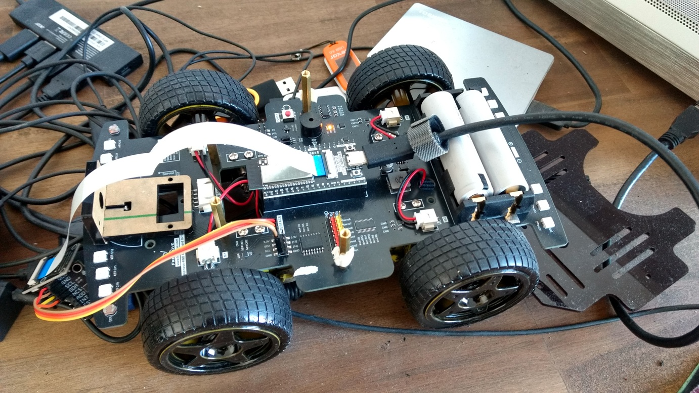
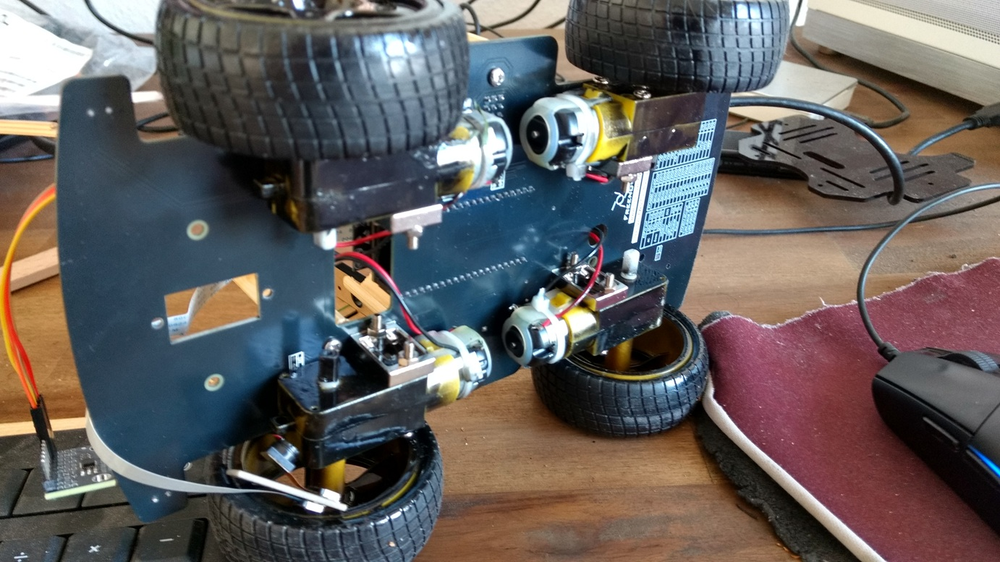
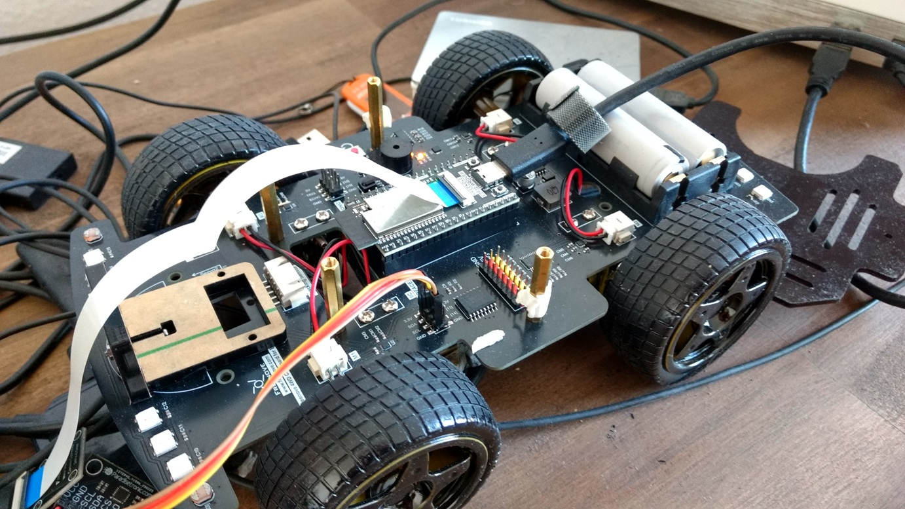
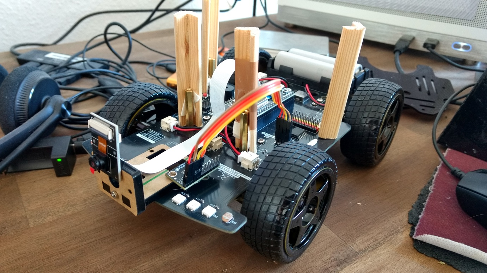
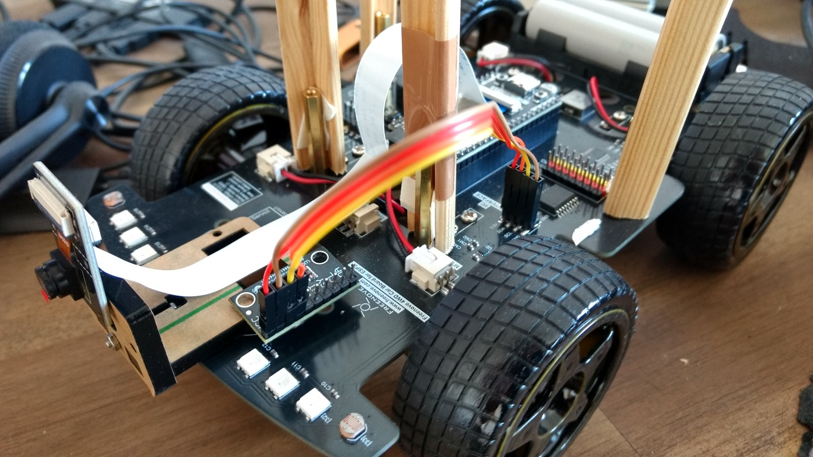
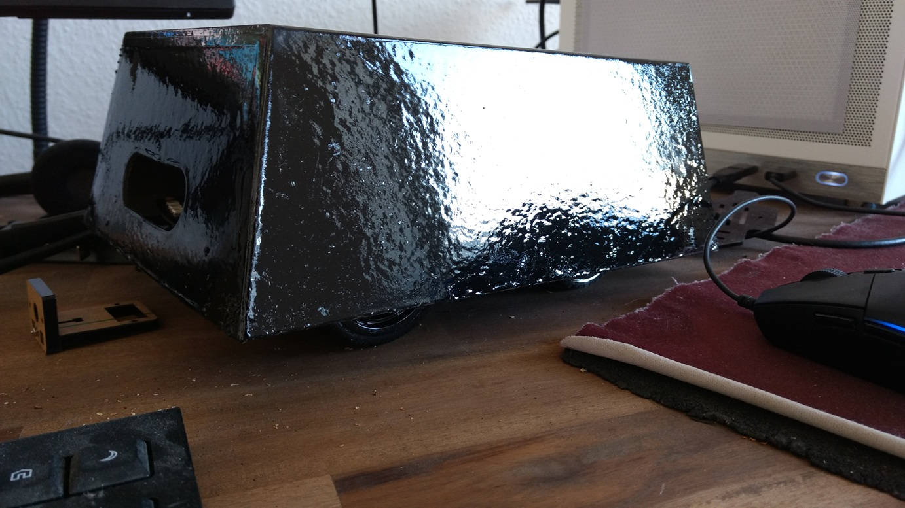
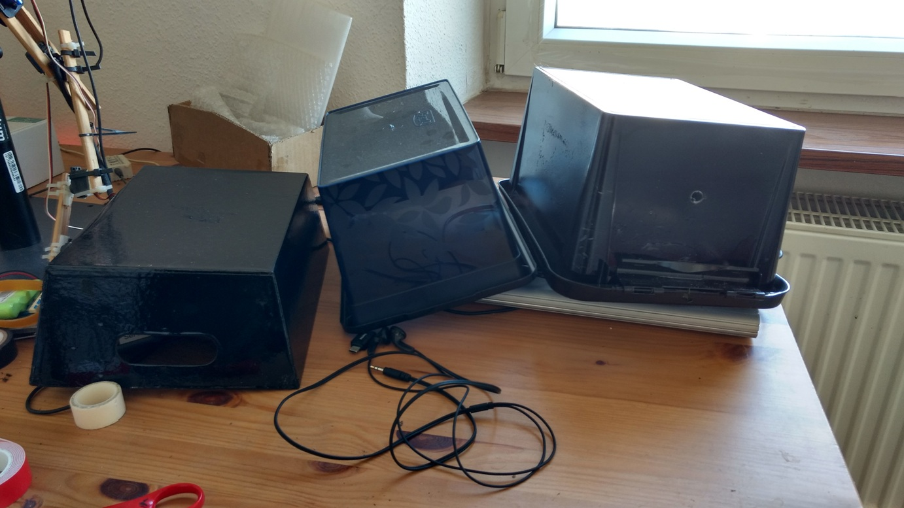

## Mouse Robot / Car

Based on Freenove 4WD Car Kit (ESP32-CAM) [Github](https://github.com/Freenove/Freenove_4WD_Car_Kit_for_ESP32)

### Content

* Single Arduino .ino File for communication with Unreal Engine Blueprint

### Build Images

